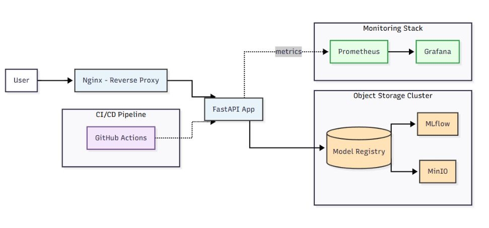
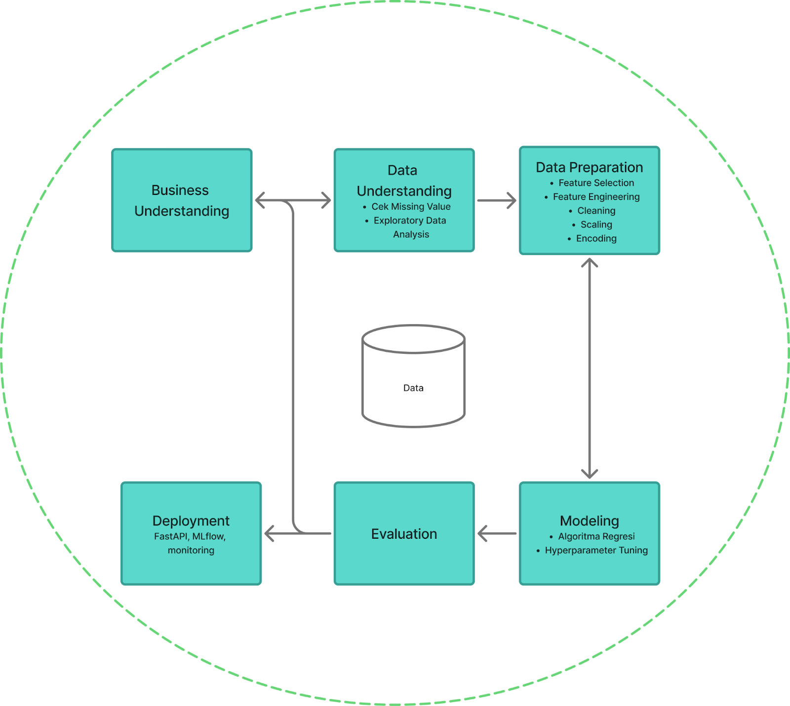
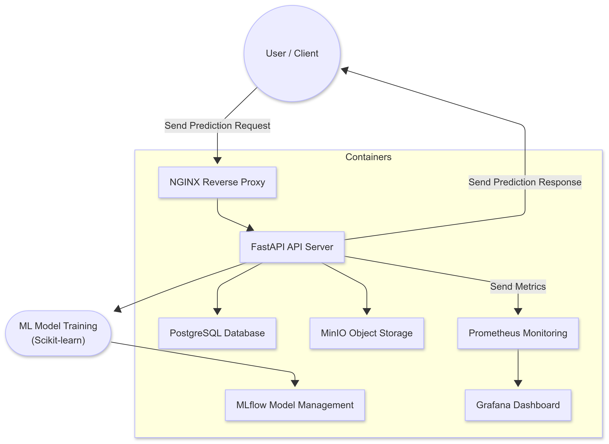
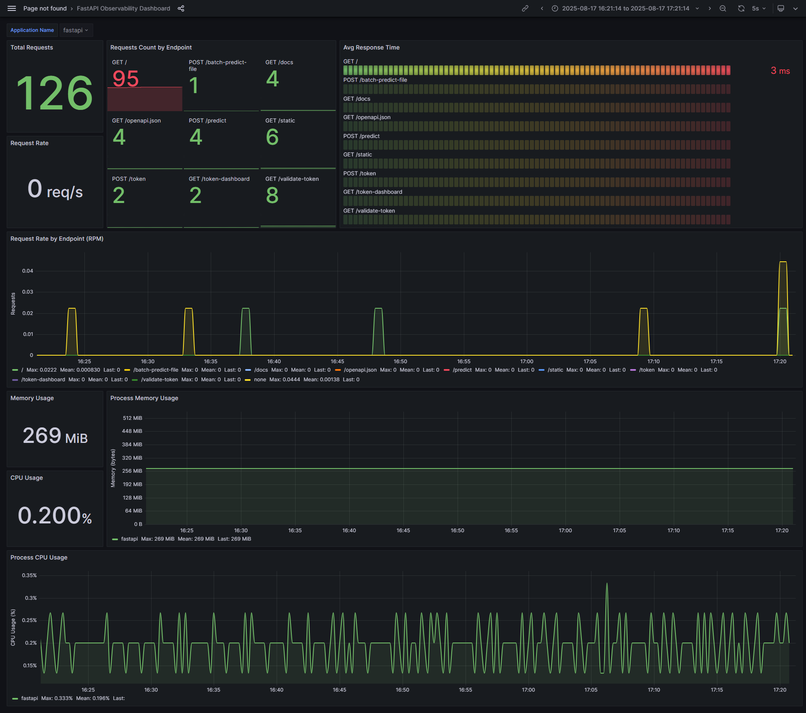
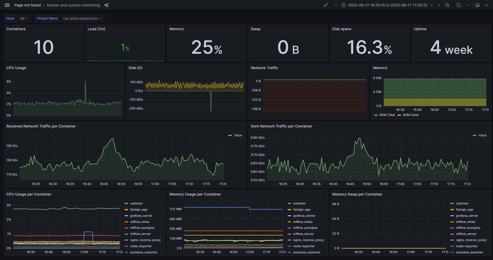

# Car Price Regression & Customer Segmentation: MLOps Pipeline with Real-time Monitoring

## Table of Contents
- [Overview](#overview)
- [Features](#features)
- [Architecture](#architecture)
- [Tech Stack](#tech-stack)
- [Project Structure](#project-structure)
- [Setup and Installation](#setup-and-installation)
- [Usage](#usage)
- [Model Details](#model-details)
- [API Documentation](#api-documentation)
- [Monitoring and Observability](#monitoring-and-observability)
- [Deployment](#deployment)

## Overview
Sistem prediksi harga mobil dan segmentasi pelanggan menggunakan machine learning dengan implementasi end-to-end yang mencakup model training, serving, dan monitoring menggunakan teknologi FastAPI, Docker, dan Grafana.

## Features
- **Machine Learning Models**: Regression model untuk prediksi harga mobil dan clustering untuk segmentasi pelanggan
- **Model Serving**: REST API menggunakan FastAPI dengan authentication
- **Real-time Monitoring**: Dashboard Grafana untuk monitoring model performance dan system health
- **Containerization**: Docker containers untuk semua services dengan Docker Compose
- **Model Management**: MLflow untuk experiment tracking, model registry, dan deployment
- **Authentication**: Token-based authentication untuk API access
- **Batch Processing**: Support untuk single dan batch predictions via API atau file upload
- **Customer Segmentation**: Clustering analysis untuk segmentasi pelanggan berdasarkan preferensi
- **Model Operations**: Dynamic model loading, updating, dan rollback capabilities
- **Performance Monitoring**: Metrics collection dengan Prometheus
- **Object Storage**: MinIO untuk MLflow artifacts dan model storage
- **Health Monitoring**: Real-time health checks untuk semua components


## Architecture
### System Architecture Overview
<p align="center">
  <br/>
  <em>Diagram arsitektur sistem menunjukkan semua komponen dan interaksinya</em>
</p>

### ML Model Training Pipeline
<p align="center">
  <br/>
  <em>Workflow training dan deployment model machine learning</em>
</p>

### Container & Infrastructure Architecture
<p align="center">
  <br/>
  <em>Arsitektur containerization Docker dan struktur deployment service</em>
</p>

## Tech Stack
### Core Technologies
- **Python 3.11+**
- **FastAPI** - Web framework untuk API
- **Scikit-learn** - Machine learning library
- **Pandas & NumPy** - Data processing
- **MLflow** - Model tracking dan registry

### Infrastructure & Deployment
- **Docker & Docker Compose** - Containerization
- **PostgreSQL** - Database untuk MLflow backend
- **MinIO** - Object storage untuk MLflow artifacts
- **Grafana** - Monitoring dashboard
- **Prometheus** - Metrics collection
- **Nginx** - Reverse proxy dan load balancer

| Layer | Technology Used | Justification |
| -------- | -------- | -------- |
| Back-End        | FastAPI/Python          | Framework API untuk serving ML models dan website. |
| Database        | PostgreSQL              | Database untuk menyimpan metadata MLflow tracking. |
| ML Framework    | Scikit-learn            | Algoritma classic ML library dengan algoritma yang mudah digunakan untuk tugas regresi. |
| Model Management| MLflow                  | Track experiment, mengelola versi model dan deployment.|
| Object Storage  | MinIO                   | Object storage yang kompatibel dengan S3 untuk MLflow artifacts.       |
| Monitoring      | Grafana, Prometheus     | Collect metrics dan menyediakan dashboard untuk monitoring sistem.|
| Deployment      | Docker, Nginx           | Containerization untuk portabilitas dan Nginx untuk reverse proxy serta load balancing. |


## Project Structure
```
car-price-prediction/
├── app/                    # FastAPI application
│   ├── app.py              # Main FastAPI application
│   ├── auth.py             # Authentication logic
│   ├── schemas.py          # Pydantic schemas
│   ├── utils.py            # Utility functions
│   ├── requirements.txt    # Python dependencies
│   ├── Dockerfile.fastapi  # FastAPI Docker image
│   ├── static/             # Static files (HTML dashboards)
├── model/
│   ├── Car_Price_Prediction_Team5.ipynb  # Model training notebook
│   └── CarPrice_Assignment.csv           # Dataset
├── grafana/                # Grafana configuration
│   └── provisioning/       # Dashboard dan datasource configs
├── prometheus/             # Prometheus configuration
│   └── prometheus.yml      # Prometheus config file
├── nginx/                  # Nginx configuration
│   └── nginx.conf          # Nginx config file
├── mlflow/                 # MLflow configuration
│   └── Dockerfile.mlflow   # MLflow Docker image
├── docker-compose.yaml     # Docker Compose configuration
└── README.md
```

## Setup and Installation

### Prerequisites
- Python 3.11+
- Docker dan Docker Compose

### Quick Start
```bash
# Clone repository
https://github.com/adiwira09/car-price-regression.git
cd car-price-regression

# Menjalankan semua services dengan Docker Compose (default configuration)
docker compose up -d

# Opsional: Buat file .env hanya jika diperlukan konfigurasi custom
# Copy dari .env.example dan modifikasi sesuai kebutuhan
```

### Manual Setup
```bash
# Setup virtual environment
python -m venv env
# On Windows:
env\Scripts\activate

# Install dependencies
pip install -r app/requirements.txt

# Setup environment variables
# Create .env file for custom configurations (optional for Docker deployment)
# Required for individual service deployment:
# - MLflow database connection
# - MinIO credentials  
# - API authentication settings

# Start individual services as needed
```

## Usage

### API Authentication
Untuk menggunakan API, Anda perlu mendapatkan access token terlebih dahulu:
```bash
# Mendapatkan access token
curl -X POST "http://localhost/token" \
     -H "Content-Type: application/json" \
     -d '{"api_key": "your_api_key"}'
```

### API Usage
```bash
# Health check
curl http://localhost/health

# Mendapatkan access token
curl -X POST "http://localhost/token" \
     -H "Content-Type: application/json" \
     -d '{"api_key": "your_api_key"}'

# Single prediction
curl -X POST "http://localhost/predict" \
     -H "Content-Type: application/json" \
     -H "Authorization: Bearer your_access_token" \
     -d '{"wheelbase": 102.4, "carlength": 175.6, "carwidth": 65.2, "curbweight": 2372, "enginesize": 122, "boreratio": 3.31, "horsepower": 92, "citympg": 27, "highwaympg": 32, "CompanyName": "Toyota", "fueltype": "gas", "aspiration": "std", "doornumber": "four", "carbody": "sedan", "drivewheel": "fwd", "enginetype": "ohc", "cylindernumber": "four", "fuelsystem": "2bbl"}'

# Batch prediction
curl -X POST "http://localhost/predict-batch" \
     -H "Content-Type: application/json" \
     -H "Authorization: Bearer your_access_token" \
     -d '[
       {
         "wheelbase": 102.4,
         "carlength": 175.6,
         "carwidth": 65.2,
         "curbweight": 2372,
         "enginesize": 122,
         "boreratio": 3.31,
         "horsepower": 92,
         "citympg": 27,
         "highwaympg": 32,
         "CompanyName": "chevrolet",
         "fueltype": "gas",
         "aspiration": "std",
         "doornumber": "four",
         "carbody": "sedan",
         "drivewheel": "fwd",
         "enginetype": "ohc",
         "cylindernumber": "four",
         "fuelsystem": "2bbl"
       },
       {
         "wheelbase": 99.8,
         "carlength": 176.6,
         "carwidth": 66.2,
         "curbweight": 2545,
         "enginesize": 109,
         "boreratio": 3.19,
         "horsepower": 102,
         "citympg": 24,
         "highwaympg": 30,
         "CompanyName": "bmw",
         "fueltype": "gas",
         "aspiration": "std",
         "doornumber": "four",
         "carbody": "sedan",
         "drivewheel": "fwd",
         "enginetype": "ohc",
         "cylindernumber": "four",
         "fuelsystem": "mpfi"
       }
     ]'

# Prediksi batch melalui upload file (CSV/Excel)
curl -X POST "http://localhost/batch-predict-file" \
     -H "Authorization: Bearer your_access_token" \
     -F "file=@cars_data.csv"

# Alternatif: Upload file Excel
curl -X POST "http://localhost/batch-predict-file" \
     -H "Authorization: Bearer your_access_token" \
     -F "file=@cars_data.xlsx"
```

### Format File untuk Batch Prediction
Untuk menggunakan endpoint `/batch-predict-file`, file CSV atau Excel harus memiliki kolom sesuai dengan schema model:

#### Kolom yang Diperlukan:
**Numerical Features:**
- `wheelbase`, `carlength`, `carwidth`, `curbweight`, `enginesize`
- `boreratio`, `horsepower`, `citympg`, `highwaympg`

**Categorical Features:**
- `CompanyName`, `fueltype`, `aspiration`, `doornumber`, `carbody`
- `drivewheel`, `enginetype`, `cylindernumber`, `fuelsystem`

#### Contoh Format CSV:
```csv
wheelbase,carlength,carwidth,curbweight,enginesize,boreratio,horsepower,citympg,highwaympg,CompanyName,fueltype,aspiration,doornumber,carbody,drivewheel,enginetype,cylindernumber,fuelsystem
102.4,175.6,65.2,2372,122,3.31,92,27,32,toyota,gas,std,four,sedan,fwd,ohc,four,2bbl
99.8,176.6,66.2,2545,109,3.19,102,24,30,honda,gas,std,four,sedan,fwd,ohc,four,mpfi
```

#### Format File yang Didukung:
- **CSV**: File `.csv` dengan comma-separated values
- **Excel**: File `.xlsx` atau `.xls`

#### Batasan Ukuran File:
- Ukuran file maksimum: Sesuai konfigurasi FastAPI (default: 16MB)

## Model Details
### Algorithm
- **Model Type**: Random Forest Regressor
- **Features**: Spesifikasi mobil termasuk wheelbase, dimensi mobil, spesifikasi mesin, dll.
- **Target**: Harga Mobil
- **Training**: Model dikembangkan menggunakan Jupyter Notebook (`Car_Price_Prediction_Team5.ipynb`)
- **Dataset**: CarPrice_Assignment.csv

### Model Features
Input features untuk prediksi harga mobil meliputi:
- **Categorical**: CompanyName, fueltype, aspiration, doornumber, carbody, drivewheel, enginetype, cylindernumber, fuelsystem
- **Numerical**: wheelbase, carlength, carwidth, curbweight, enginesize, boreratio, horsepower, citympg, highwaympg

### Model Evaluation
- **R² Score**: 0.96
- **Root Mean Square Error (RMSE)**: 1778.64
- **Mean Absolute Error (MAE)**: 1233.13
- **Accuracy Segmentation**: 0.95

## API Documentation
API documentation tersedia di:
- **Swagger UI**: http://localhost/docs
- **ReDoc**: http://localhost/redoc

### Main Endpoints
#### Dashboard & Authentication
- `GET /` - Dashboard utama untuk prediksi harga mobil
- `GET /token-dashboard` - Dashboard manajemen token API
- `POST /token` - Autentikasi dan mendapatkan access token dengan API key
- `GET /validate-token` - Validasi apakah access token masih berlaku

#### Prediction Endpoints
- `POST /predict` - Prediksi harga mobil tunggal berdasarkan spesifikasi
- `POST /batch-predict` - Prediksi harga multiple mobil dalam satu request JSON
- `POST /batch-predict-file` - Prediksi batch dengan upload file CSV/Excel
  - *Format yang didukung: CSV (.csv), Excel (.xlsx, .xls)*
  - *Authentication diperlukan: Bearer token*
  - *File harus berisi semua kolom yang diperlukan sesuai model schema*

#### Model Management
- `GET /model/metadata` - Informasi detail model yang sedang aktif
- `POST /model/load` - Load model tertentu berdasarkan nama tanpa mengubah stage di MLflow
- `POST /model/update` - Promote model dari Staging ke Production dan reload ke memory
- `POST /model/rollback` - Rollback ke versi model sebelumnya dari Archived ke Production

#### System Monitoring
- `GET /health` - Health check komprehensif untuk API dan semua dependencies
- `GET /metrics` - Prometheus metrics untuk monitoring performa sistem

## Monitoring and Observability
### Grafana Dashboard
Access dashboard di: http://localhost:3000
- Default credentials: admin/admin

#### === Dashboard monitoring untuk FastAPI ===
<p align="center">
  <br/>
  <em>
    Custom FastAPI Observability Dashboard (based on 
    <a href="https://grafana.com/grafana/dashboards/22676-fastapi-observability/">Grafana Template #22676</a>)
  </em>
</p>

**Metrics yang Dimonitor:**
- **Total Requests**: Jumlah total HTTP requests yang diterima
- **Request Rate (RPS)**: Requests per second dalam real-time
- **Requests Count by Endpoint**: Distribusi request berdasarkan method dan handler
- **Average Response Time**: Waktu response rata-rata per endpoint
- **Request Rate by Endpoint (RPM)**: Trend request rate per endpoint dari waktu ke waktu
- **Memory Usage**: Konsumsi memory process resident
- **CPU Usage**: Persentase utilisasi CPU process
- **Process Resource Monitoring**: Timeline penggunaan CPU dan memory

#### === System & Container Resources Monitoring Dashboard ===
<p align="center">
  <br/>
  <em>
    Docker and System Monitoring Dashboard (based on 
    <a href="https://grafana.com/grafana/dashboards/4271-docker-and-system-monitoring/">Grafana Template #4271</a>)
  </em>
</p>

**Metrics yang Dimonitor:**
- **Container Count**: Jumlah containers yang berjalan
- **System Load**: Load average 1 menit
- **Memory Percentage**: Utilisasi memory sistem
- **Swap Usage**: Konsumsi swap space sistem
- **Disk Space**: Persentase penggunaan filesystem
- **System Uptime**: Durasi uptime server
- **CPU Usage**: Utilisasi CPU sistem host
- **Disk I/O**: Operasi read/write per device
- **Network Traffic**: Bandwidth jaringan masuk/keluar
- **Container-Specific Metrics**:
  - Traffic jaringan per container (received/sent)
  - Penggunaan CPU per container
  - Penggunaan memory per container (RSS)
  - Memory swap per container

### Prometheus Metrics
Metrics collection di: http://localhost:9090

### MLflow Tracking
MLflow UI tersedia di: http://localhost:5000
- Model registry dan experiment tracking
- Model versioning dan deployment

### MinIO Console
Object storage console di: http://localhost:9001
- MLflow artifacts storage
- Model files dan metadata

## Deployment
### Services yang Berjalan
- **FastAPI App**: Port 80 (via Nginx reverse proxy) - Main API service
  - *Internal container port: 8000*
- **MLflow**: Port 5000 - Model tracking dan registry
- **Grafana**: Port 3000 - Monitoring dashboard
- **Prometheus**: Port 9090 - Metrics collection
- **MinIO**: Port 9000/9001 - Object storage
- **PostgreSQL**: Port 5432 - MLflow backend database
- **Nginx**: Port 80 - Reverse proxy to FastAPI

### Environment Variables

**Untuk Docker Deployment (Recommended):**
- Docker Compose sudah memiliki konfigurasi default untuk semua services
- Tidak perlu membuat file `.env` tambahan untuk deployment standar
- Konfigurasi default sudah mencakup: PostgreSQL, MinIO, Grafana, dan authentication key

**Untuk Custom Configuration atau Individual Service:**
Buat file `.env` jika ingin mengubah konfigurasi default:
```
# Database Configuration
POSTGRES_MLFLOW_HOST=mlflow-postgres
POSTGRES_MLFLOW_USER=mlflow
POSTGRES_MLFLOW_PASSWORD=mlflow
POSTGRES_MLFLOW_DB=mlflow

# MinIO/S3 Configuration
AWS_ACCESS_KEY_ID=minioadmin
AWS_SECRET_ACCESS_KEY=minioadmin

# Grafana Configuration
GRAFANA_ADMIN_USER=admin
GRAFANA_ADMIN_PASSWORD=admin

# Authentication Key
SECRET_KEY=your_custom_secret_key
API_KEY=your_custom_api_key
```

> **Note**: File `.env.example` tersedia sebagai template untuk kustomisasi
